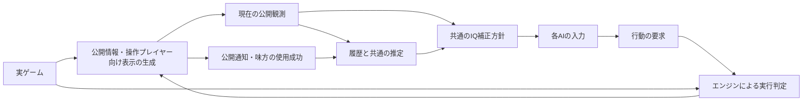

# 人間の情報条件に合わせるAI観測境界（設計案）

## 目的と判定基準

NGの基準は「人間がプレイ中に把握できる情報かどうか」とする。
内部データを参照したという理由だけでNGにしない。描画、公開通知、
自分・味方の行動履歴、公開ルールから同じ情報を同じ精度で得られるかを判定する。
正しく敵位置を予想したという結果だけでもNGにしない。

これは設計案であり、現在のコントローラーの入力や挙動は変更していない。
対象は現在選択可能な全AI。学習・評価・大会・GUIで同じ公開情報の契約を使う。

ユーザーが求める検査は次の2つ。

1. プレイヤー視点で把握できない情報を知っていないか。
2. 他チームより有利になる、非共通の入力補助・状態変更・実行処理がないか。

観測の制限だけでは2を防げないため、情報の境界と行動実行の境界を両方設ける。

## 調査結果の読み替え

| 情報・経路 | 人間基準での扱い |
| --- | --- |
| スモークの敵味方 | 自分・味方の使用履歴などから判別できるならOK。内部teamの参照だけではNGと判定しない。 |
| 味方座標の共有 | 人間にも味方位置や通信が与えられるならOK。IQ誤差を適用するかは別のゲームルール。 |
| 視認済み敵の正確な座標 | 操作画面がマス単位で表示するならOK。IQ補正の有無は別に決める。 |
| 未視認敵の現在HP・残アビリティ数・ULTポイント | 現在の左右パネルに表示されるため公開情報としてOK（ユーザー確認済み）。 |
| 未視認敵の現在位置による占有判定 | 事前に問い合わせて真の占有状態を知るのはNG。記憶・予想による回避や、実際に移動した結果の認知は別扱い。 |
| 未視認敵の現在blind状態 | 効果の成功を知らせる表示・通知などで確定できればOK。投擲しただけで、見えていない敵への命中を真値から知るのはNG。 |
| 未視認敵の最後に見たHP・座標 | 記憶としてOK。「最後に見た値」と「現在の真値」を区別する。 |
| 投射物の未来の経路・着弾先 | 公開ルールと観測済み軌跡からの予測はOK。未知の敵行動・位置を使った真の未来はNG。 |

前回の「内部teamを読むからNG」「未視認敵HPだからNG」という判定は、
この基準では成立しない。情報を取得できる根拠を確認してから分類する。

現行コードの根拠:

- `rendering_ui.py::_draw_team_panel` は双方のHP、残アビリティ数、ULTポイントを表示し、視認条件で制限していない。
- マップ上のキャラクター表示には `is_visible_to_team` を適用している。
- `fnatic_v3/smoke_recon.py` はスモークの内部team/ownerを参照する。共通の合法な帰属情報に置き換える対象であり、挙動自体を禁止するという意味ではない。
- `fnatic_v3/ultimate_tactics.py::_landing_free` は実ゲームの占有関数に問い合わせる。未視認敵の占有で結果が変わることを再現済み。
- GC等の観測には全敵のblind状態から作るフラグがある。合法な成功通知・推定から作るフラグと区別する必要がある。
- `public_effects.py` と `frc_v1/memory.py` に表示情報のコピーと自身の使用履歴からの推定が既にある。ただし全AI共通の人間情報契約にはなっていない。

## 契約として決めること

1. 公開情報の基準は、人間の操作画面と実装済みの通知。観戦画面・リプレイの全知情報を自動的に含めない。
2. 現在の敵HP・残アビリティ数・ULTポイント表示は公開扱いとする（ユーザー確認済み）。
3. 味方間で共有できる情報の範囲。人間にも共有される情報だけを共通入力へ含める。
4. IQ補正を情報の合法性から分けるか。推奨案は「合法情報を作った後、共通ルールでIQ補正」。

IQ補正の位置付けなど、未回答の項目は仕様確定済みとして実装しない。
特に操作画面の表示内容を黙って削除しない。

## 情報の種類

同じ属性でも根拠と精度によって扱いを変える。

- **公開された現在値**: HPパネル、合法な視認、公開された通知などから得た現在の情報。
- **履歴**: 最後に見た位置・HP、味方の使用成功、観測した効果の出現・消失。
- **履歴から導いた情報**: スモークの帰属、公開された持続時間からの残時間、到達可能な敵位置。
- **予測**: 敵が向かいそうなサイト、未確認の命中可能性。実ゲームの真値から正誤を補正しない。

必要な箇所には、値と一緒に根拠、観測tick、現在値か記憶か、
確定値か候補集合・範囲かを持たせる。根拠IDはモデルが自己申告するだけのものにしない。
推定の正確さを、人間に与えられていない真値を読んで保証しない。

### スモークの例

チームの使用成功イベントと、効果の出現位置・タイミングを対応付ける。
自チームが使っていないと確定でき、公開ルールで他の発生源もないなら敵と判定できる。
人間にも対象のスモークを識別できる情報がある場合は、その精度の帰属情報を公開契約に含められる。

重なった複数効果、使用失敗、観測開始前の効果などで対応付けが曖昧なら、
候補や不明として扱う。内部ownerの真値で曖昧さを消さない。
ただしゲームが人間にも明示的な使用通知を提供する場合は、その通知を根拠に確定させられる。

## 構成案

実ゲームを読めるのは観測生成と実行処理に限定する。
モデルにはコピーした値と公開情報だけで計算する関数を渡す。
旧AIを接続する互換層も同じ境界から作る。

- 現行の `PerceivedGameView.__getattr__` のような実ゲームへの汎用転送は使わない。
- `real_character`、`real_game`、bound method、内部コントローラー、全知リプレイへの参照を入力に残さない。
- LOS・経路探索は公開された地形・煙・既知の位置で計算する。
- 行動maskやESCAPE候補の事前判定に、未知の敵の実位置を使わない。
- 行動要求を受けた後の衝突・命中・不成立は、実ゲームで通常どおり解決する。
  モデルへ返すのは人間も実行後に認知できる結果だけ。
- 表示とAIで公開情報を共用し、GUIのない大会でも同じ通知を生成する。

## 行動・入力補助の共通ルール

情報が合法でも、あるチームだけが射撃直前に向きを変更できる、命中率補正を省略できる、
1tickに追加で行動できるなら実行条件が違う。これも検査対象にする。

判定対象は補助処理の存在と実行条件。勝率や正面補正100%の頻度だけでNGにしない。
共通ルールで許された向きコマンドを合法な観測から適切に選ぶことは、AIの判断能力として扱う。
他チームには与えられない入力、非公開の真値による補助、許されない時点での方向変更はNG。

### 向きチートの検査

過去の「射線が通った敵へ自動で向き、常に正面補正を使う」不具合は、
次の不変条件で防ぐ。

- 向き変更の理由は、共通ルールの移動、受理された向きコマンド、方向付きスキル、
  共通の射撃応答など、明示した理由に限定する。
- 敵が射線に入ったという事実だけで、特定チームの方向を射撃直前に変更しない。
- 向きコマンドを受理できる時点・回数・強制方向への優先順位を全チームで揃える。
- 射撃中は確定済みの向きを使う。標的ごとに向きを合わせ直さない。
- 命中率の角度補正はエンジンが計算する。AIが倍率を指定したり、補正を免除されたりしない。
- 非公開の敵位置から向きを決める経路は、情報検査でもNGにする。

現行コードでは `battle_logic.py::move_character` が射撃応答の強制方向を保護し、
`_resolve_all_shots` が現在の向きから角度補正を計算する。
FRCやcoachには `char.facing` を直接変更する互換処理があり、
全AIから直接書き換えを排除する行動境界はまだ実装されていない。
既存の保護と、将来の共通境界の実装完了を混同しない。

### 行動境界と実行ログ

モデルは移動・向き・スキル等の要求を返すだけにする。
実キャラクターの向き、HP、命中精度、移動済みフラグ、資源等を直接変更させない。
既存の合法な直接変更は、同等の明示的なコマンドへ移す。
実行処理はルールを検証し、許された要求だけを反映する。

監査用に以下を記録する。

- 使用した公開観測のID、round/tick/phase、観測時点。
- AIが要求した移動・向き・スキルと、受理・修正・拒否した内容。
- 向きの変更前後、変更理由、射撃応答の強制方向の有無。
- 射撃時の確定方向、標的との角度、角度補正、移動・blind等の追加補正。
- コントローラー実行中の、コマンドに含まれない実ゲームへの状態変更。

監査ログは判定者向けの非公開情報を含むため、モデル入力へ戻さない。
「疑わしい頻度」は調査のきっかけに使い、違反の確定には経路・ルール違反の証拠を使う。

### モデル間で揃える条件

- 入力の公開範囲・精度・更新タイミング。IQを採用する場合は共通方針を別途確定する。
- 1tickあたりの行動数、向き変更の受付時点、射撃との順序。
- 移動・スキル・強制方向・射撃補正の処理。
- キャッシュや一括推論による観測時点の差。
  現在のFRCはチーム行動前に観測を固定し、従来AIは逐次行動中に観測を作るため、
  この差も比較対象にする。どちらが常に有利かは決めつけない。

合法な戦術・モデル性能・ロスター能力の差をチート扱いにしない。
同じ能力値と同じ要求を与えた際、コントローラーの種類だけで実行結果が変わらないことを確認する。

DTO化は通常の入力経路の漏れを防ぐ。敵対的なPythonコードまで想定する場合、
同じプロセスの中だけでは十分な保護にならない。必要なら推論を別プロセスに置き、
公開観測だけをシリアライズして送る。全知ログなどの読取経路もその段階で制限する。

## 自動検査

人間が行う推論を一般的にすべて自動判定するのは難しい。
そのため「合法情報の生成経路を共通化し、その経路以外から状態が入らないか」を検査する。

### 対になる世界での検査

プレイヤーに与えられた全観測、公開通知、味方の履歴が同じで、
未知の内部状態だけが異なる2つのゲーム状態を作る。
両方でAI入力と事前の行動maskが一致することを検査する。
判断まで比較する場合はモデル状態・乱数状態も揃える。
行動後の物理的な結果まで一致させる必要はない。

具体例:

- 未視認敵を移動しても、既知の位置情報・事前のESCAPE候補を変えない。
- 成功通知のない未視認敵のblindだけを変更しても、入力を変えない。
- 最後に見た敵のHPだけが知られている場合、非公開の回復でその記憶を更新しない。
- 公開扱いの敵HPを変えると公開観測も変わる。
  これは入力一致テストの前提を満たさず、NGの検出例には使わない。
- スモークのteamを変える際も、味方の使用履歴と矛盾する架空状態を作らない。
  人間が帰属を区別できる履歴の違いまで消して「表示が同じだからNG」としない。
- 複数tickを使い、見た情報の記憶は残せるが、見失った後の真値を追跡しないことを確認する。

### 入力の構造検査

- 入力にlive game、Character、bound method、隠れた参照が残っていないこと。
- 「不明」を座標 `(-1, -1)` としてLOSへ流し、視認扱いにしないこと。
- IQ補正を検査する場合は合法性検査から分離し、モデルごとの例外を明示すること。
- 学習時に使う真値の報酬・critic・教師ラベルが、実戦actorの入力へ混ざらないこと。

### 行動と射撃の自動検査

- 攻守・コントローラー種類を替えても、同じ局面と同じ要求は同じルールで処理されること。
  ロスター・能力値・乱数・観測時点を揃え、単純な勝率比較を代用にしない。
- 向きコマンドのない局面で敵が射線に入っても、敵方向への自動変更が発生しないこと。
- 1回の射撃処理で複数標的の候補があっても、候補ごとに正面へ向き直らないこと。
- 共通の射撃応答が次tickに適用され、モデルの出力や副作用で解除されないこと。
- PLANT/DEFUSE/ABILITY/ULTIMATE等の早期returnでも、方向の優先順位が変わらないこと。
- 角度補正を記録した方向と標的位置から独立に再計算し、実際に適用した倍率と一致すること。
- ラッパー、GUI/headless、setup/live、攻守交代で追加の自動入力が発生しないこと。

既存の `test_combat_facing_rules.py`、`test_fnatic_v3_facing.py` 等を回帰検査の土台にできる。
それらの成功だけで、全コントローラーの情報経路・書換経路の遮断を証明したことにはしない。

予想が当たった回数だけをチート検出の根拠にしない。
合法な履歴だけから導ける予測は、精度が高くても許容する。

## 導入順序

1. 人間の操作画面・通知・味方共有の公開契約を確定する。
2. 表示とAIで使う公開観測・使用成功イベント・履歴を共通化する。
3. 既存AIの入力を記録して比較する。公開情報の不足と真値の漏れを区別する。
4. 互換層を経由して全AIを共通の観測境界・行動境界に接続する。
5. 情報の対比較と行動・射撃の検査で漏れや非共通の補助を防ぎ、必要なモデルだけ再学習・評価する。

過去にNG候補とした挙動を、そのまま一括禁止する方針にはしない。
公開契約に合うものは合法な生成経路を用意して維持する。
